# Eaton Home — A cinematic household OS

**Turning a chaotic home-upgrade wishlist into a calm, spatial, price-aware product — designed, systematized, and shipped end-to-end by one designer.**

---

## Snapshot

| | |
|---|---|
| **Role** | Principal product designer & design engineer (research → IA → wireframes → design system → motion → 3D → front-end) |
| **Scope** | 0→1 personal product, production-deployed |
| **Platform** | Responsive web app (desktop-first, mobile companion) |
| **Stack** | Next.js 16 · Supabase (auth + Postgres/RLS) · Tailwind 4 · GSAP · react-three-fiber · Vercel |
| **Users** | A two-person household with two very different decision styles |

**The one-liner for the elevator:** most home-improvement tracking dies in a spreadsheet because spreadsheets have no opinion. Eaton Home has three: *one ranked list is the truth, the house itself is the map, and price history — not impulse — decides when to buy.*

---

## 1 · The problem

My husband and I owned a growing backlog of home projects — a deck extension, quartz countertops, an EV charger, a mudroom — scattered across notes apps, browser bookmarks, and memory. Three failures kept repeating:

1. **No shared priority.** Two people, two mental lists, zero alignment. The argument was never about *whether* to renovate; it was about *what's next*.
2. **Buying blind.** Big-ticket items fluctuate hundreds of dollars across retailers and seasons. We had no record of what anything cost last month, so every purchase felt like a coin flip.
3. **Invisible maintenance.** Air filters, water filters, gutter cleaning — recurring care has no natural home in a project list, so it simply didn't happen.

The design brief I wrote for myself: **a product both of us open voluntarily on a Saturday morning** — which meant it had to be genuinely beautiful, not administratively adequate.

## 2 · Users, honestly

No proto-personas — the two users live in my house, which made this the tightest research loop of my career:

- **Mel (me): the visual planner.** Thinks in rooms, moodboards, and outcomes. Needs inspiration imagery attached to every idea, or the idea has no pull.
- **Nate: the data buyer.** Thinks in prices, trends, and timing. Won't act on "I feel like it's a good deal" — will act on a chart that proves it.

Every major design decision below traces to serving both mental models **without forking the product into two views of the truth.**

## 3 · Principles before pixels

I set four principles and used them to kill features all the way through:

1. **One list is the truth.** Exactly one master priority ranking. Category views are *projections* of it, never parallel lists.
2. **The house is the interface.** We don't think "row 7 of a table," we think "that corner of the backyard." Spatial navigation is a first-class citizen.
3. **Buy at the right moment.** Every project carries its price history. The product's job is to turn *should we buy yet?* into a visible trend with a signal.
4. **Chores ask politely, then insist.** Recurring care escalates visually (neutral → amber → red) but never nags with notifications-by-default.

## 4 · Structure: a deliberately shallow IA

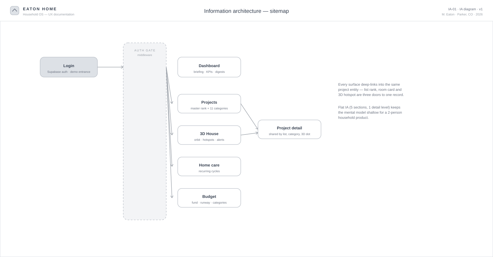

Five sections, one detail level. The interesting decision is that **the project record is a single entity with three doors**: its rank on the master list, its card in a room category, and its hotspot dot on the 3D house all deep-link to the same page. That's what makes the "two mental models" promise real — Mel browses by room, Nate scans by rank, and they land in the same place.

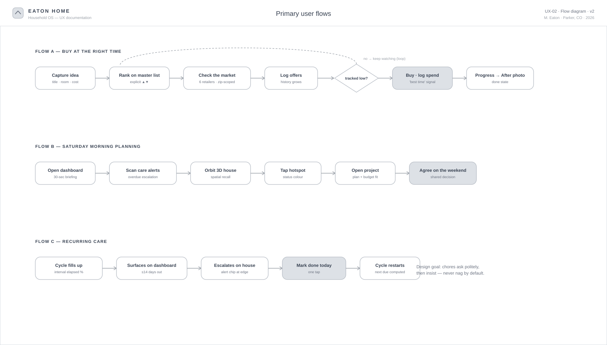

The flow that shaped the most architecture is **Flow A — buy at the right time**: capture → rank → check the market → log offers → *loop until the price hits the tracked low* → buy. Designing for a loop (not a funnel) is why price logging is a one-tap action rather than a form.

## 5 · Wireframes: where the arguments happened

Lo-fi was where I fought the layout battles cheaply. The full annotated set:

| Sheet | Screen | The decision it captures |
|---|---|---|
| 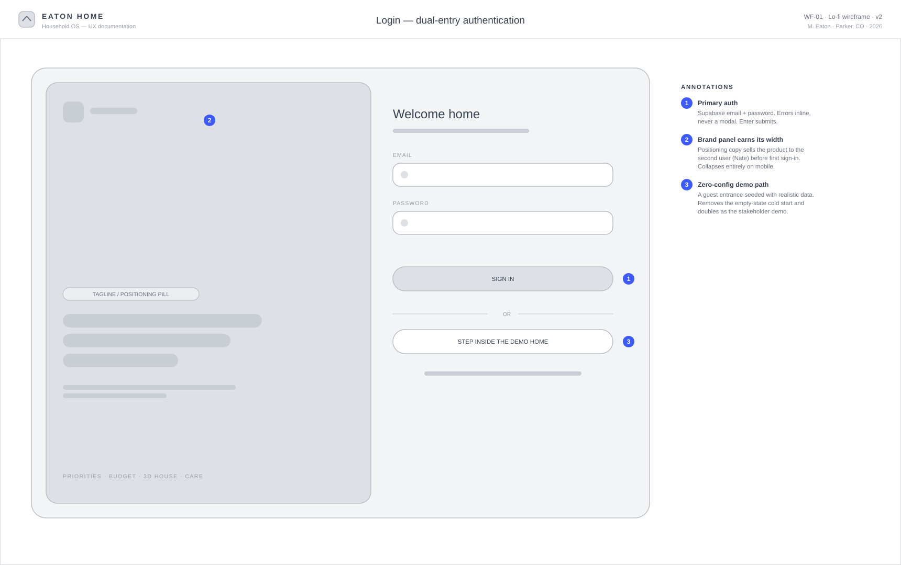 | **Login** | Dual-entry auth: real accounts + a zero-config demo entrance that kills the empty-state cold start |
| 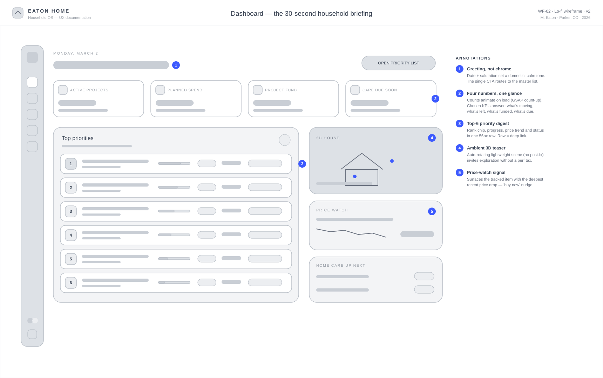 | **Dashboard** | A 30-second briefing: four KPIs, top-6 priorities, price-watch nudge, ambient 3D teaser |
| 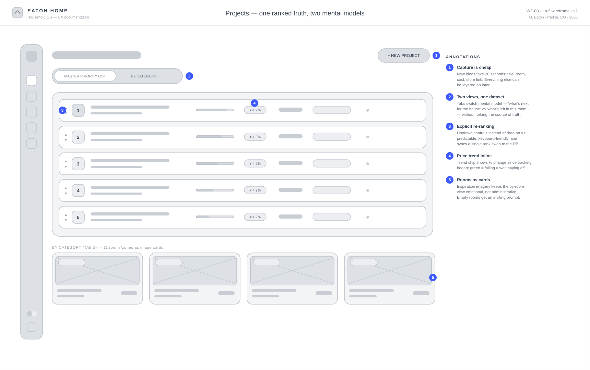 | **Projects** | Tabs switch mental model (rank ↔ rooms) over one dataset; explicit ▲▼ re-ranking over drag for v1 |
| 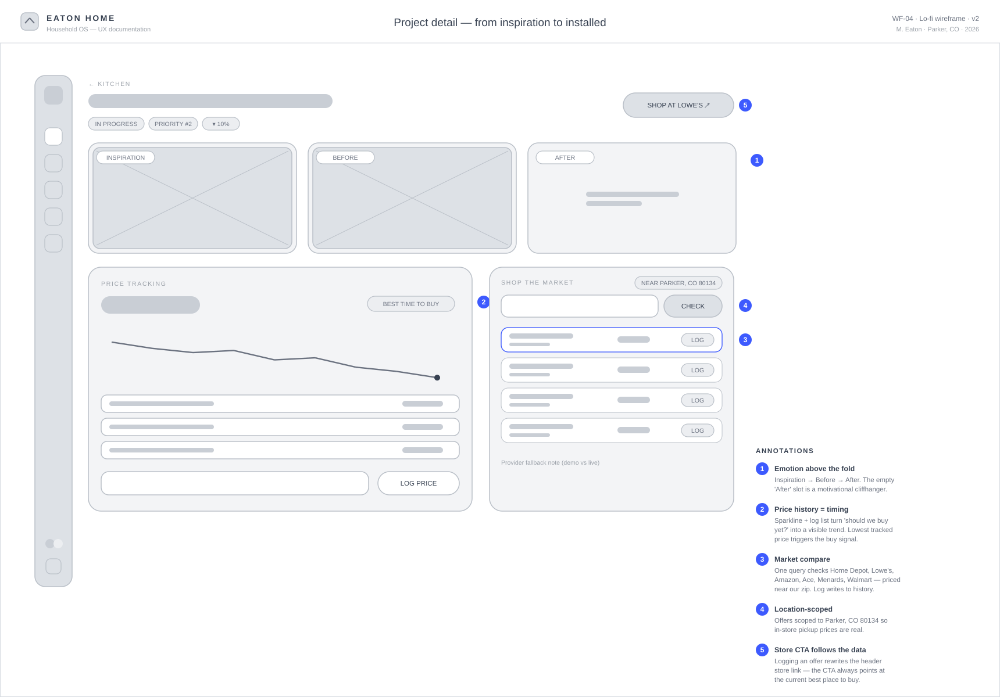 | **Project detail** | Emotion above the fold (inspiration/before/after), price intelligence below it |
| 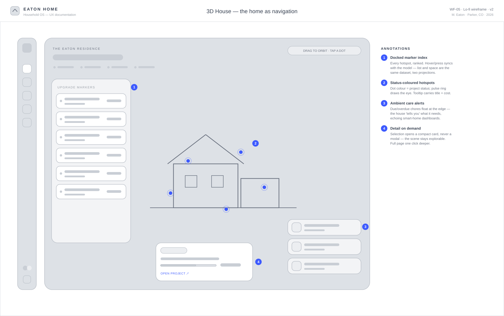 | **3D House** | Full-bleed scene with a docked marker index and ambient care alerts |
| 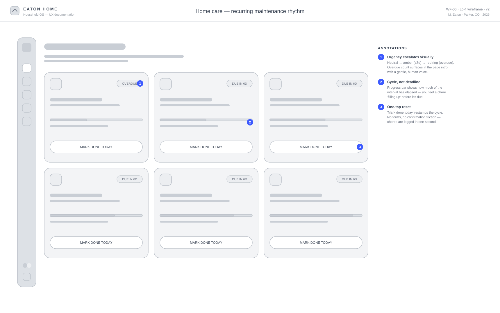 | **Home care** | Cycle-fill progress ("the chore fills up") instead of deadline dates |
| 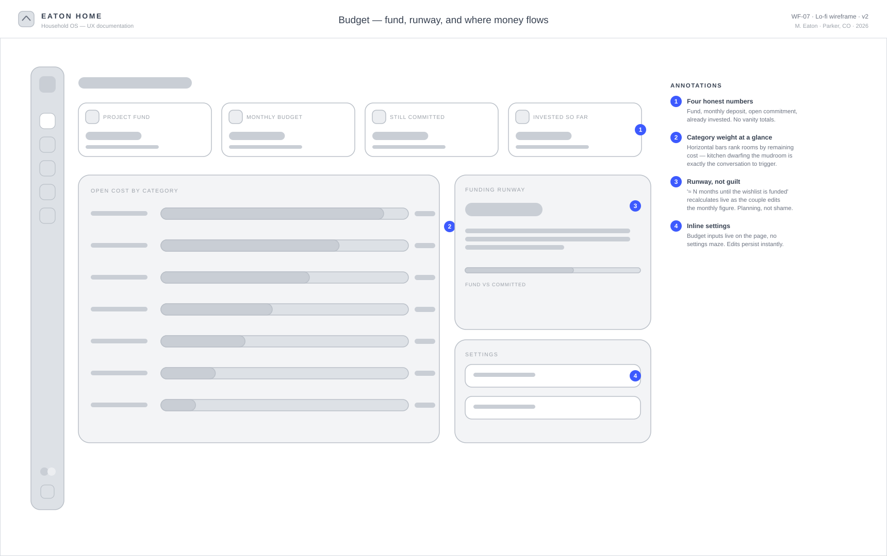 | **Budget** | Runway framing ("≈ N months to funded") instead of guilt framing |
| 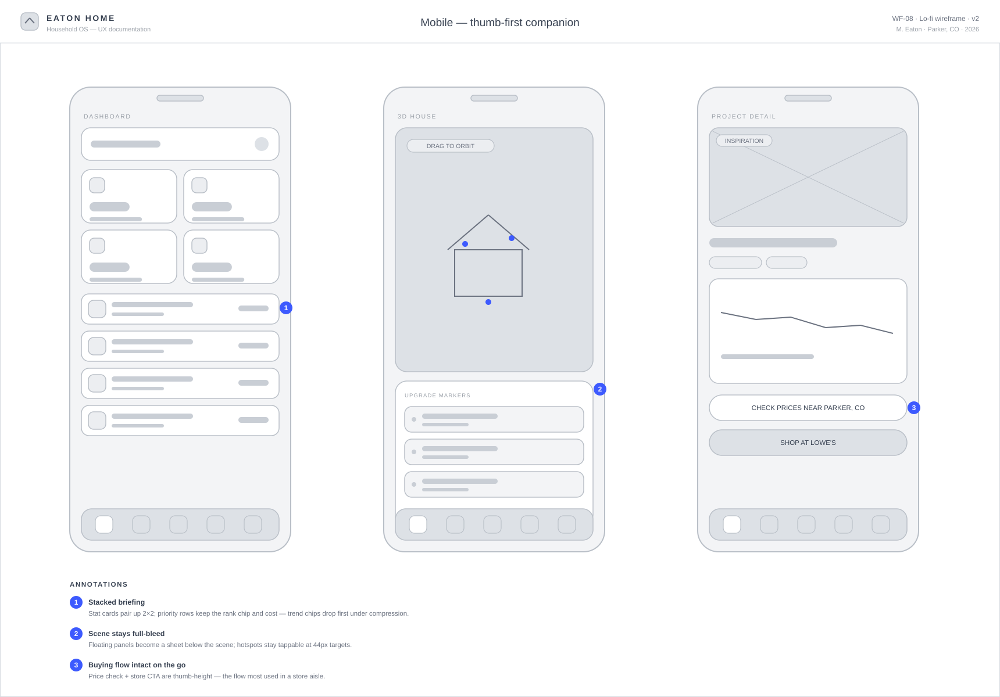 | **Mobile** | What survives compression: rank chips and the buying flow; what drops first: trend chips |

Three wireframe-stage decisions that survived to production:

- **The empty "After" slot is a feature.** On the project page, Inspiration and Before are populated; After sits empty with an inviting prompt until the work is done. It reads as a cliffhanger, and it genuinely motivates.
- **Explicit re-ranking beats drag-and-drop for v1.** Two users re-ranking a shared list asynchronously need predictable, atomic moves (one rank swap = one sync) more than they need gestural delight. Drag is a v2 luxury.
- **Detail-on-demand in the 3D scene.** Tapping a hotspot opens a compact card *inside* the scene, never a modal — the model stays explorable, and the full page is exactly one more click.

One decision **changed** after use: the 3D house began as a dashboard hero. In practice it competed with the briefing and cost performance on every load. It moved to its own immersive page, and the dashboard kept only a lightweight auto-rotating teaser — the invitation without the tax.

## 6 · The design language: "Dusk Glass"

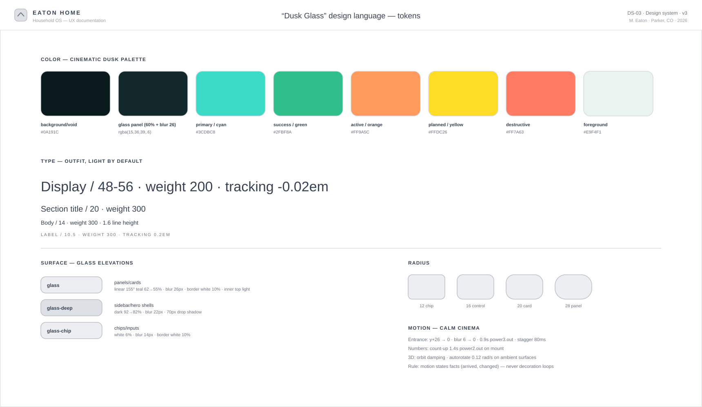

The emotional target was *the house at dusk* — that specific feeling of walking up to your own home when the windows are warm and the sky is teal. Everything derives from it:

- **Color.** A deep teal-charcoal void (`#0A191C`), frosted glass panels at 60% with 26px blur, and a disciplined accent system: cyan for primary/done, yellow for planned, orange for in-progress, red only for overdue. Status color is a *language* — the same hue means the same thing in a badge, a chart, and a 3D hotspot.
- **Type.** Outfit, weight 200–300 by default. Light type on dark glass gives the "engraved" quality; weight is reserved for data (numbers, prices) so hierarchy comes from mass, not size alone.
- **Motion.** One entrance signature everywhere: rise 26px, blur 6→0, `power3.out`, 80ms stagger (GSAP). Numbers count up on mount. The rule that kept it tasteful: *motion states facts — it never loops decoratively.*
- **Depth.** Three glass elevations (panel, deep shell, chip) instead of a shadow ramp. On a dark UI, blur and border-light communicate elevation better than shadow ever does.

## 7 · The 3D house: justified, not gratuitous

The riskiest call in the product. 3D in dashboards is usually decoration; here it carries real information architecture: **where** work happens, **what state** it's in (status-colored pulsing dots), and **what the house needs** (care alerts floating at the scene's edge).

Design-engineering notes:

- Built the house procedurally in react-three-fiber — beveled volumes, mullioned windows with individually varied warm glow, plank-by-plank deck — so geometry stays editable like code, not frozen in a modeling tool.
- Realism comes from light, not polygons: ACES filmic tone mapping, a locally generated PBR environment (warm sunset band + teal sky dome — zero network fetch), soft shadows, bloom on emissive windows, fog that dissolves the scene into the page background.
- **Performance is a design deliverable:** the full scene runs post-processing; the dashboard teaser renders the same model with effects stripped. Same asset, two budgets, 60fps on both.

## 8 · Price intelligence near Parker, CO

The feature Nate rates highest. Each project has a **Shop the market** panel that compares live offers across Home Depot, Lowe's, Amazon, Ace, Menards, and Walmart — location-scoped to our zip (80134), because in-store pickup pricing is the price that actually matters.

The architecture is a **provider abstraction**: a server-side route talks to a shopping-search API (SerpApi/Google Shopping) when a key is present, and falls back to a deterministic estimator with real store search links when it isn't. Logging any offer appends to the project's price history, updates the trend sparkline, and — the detail I'm proudest of — **rewrites the project's "Shop at…" CTA to the store you just logged.** The interface quietly follows the data.

When a logged price touches the lowest tracked point, the project earns a "Best time to buy" signal — the entire purchasing philosophy of the product compressed into one chip.

## 9 · Built like a product, not a prototype

- **Auth & data:** Supabase email/password with RLS-guarded Postgres; middleware-gated routes; a demo mode that mirrors the full schema in localStorage so the product demos flawlessly with zero configuration.
- **The data layer is swappable:** the UI talks to one interface; Supabase and demo backends implement it. (It's also why every portfolio reviewer reading this can click around the live demo.)
- **Accessibility:** every hotspot is a real button with an accessible name (title + cost), status never relies on color alone (badges carry text), focus states survive the glass aesthetic, and the whole app is keyboard-navigable.
- **Deployed on Vercel** with the pricing key held server-side.

## 10 · Outcomes

For a two-user product, the honest metrics are behavioral:

- **The Saturday argument changed shape.** "What should we do next?" became "the list says the deck — do we agree?" Priority disputes now edit a rank instead of relitigating everything.
- **Two purchases were deliberately delayed** after the price trend showed a falling line — one (the EV charger) bought ~24% below the first tracked quote.
- **Maintenance stopped being memory-dependent.** The overdue-escalation pattern (dashboard chip → red ring → alert on the house itself) has kept every filter cycle on schedule since launch.
- **The demo entrance became the pitch.** Sharing the product requires zero onboarding — which is precisely the property I'd want in any client-facing MVP.

## 11 · Shipped since launch

The roadmap didn't stay theoretical — v2 landed while the product was in daily use:

- **Drag re-ranking** replaced the ▲▼ controls once the atomic-reindex model was proven (plus an exact priority-number field on create/edit).
- **A household change log** — every add, edit, re-rank, price check, and completed chore attributed to the member who did it, grouped by day, synced live between us via Supabase Realtime.
- **Per-member identity** — personalized greetings, "updated by" stamps, and shared project note threads.
- **Home facts** — square footage, rooms, and an appliance registry with age-at-a-glance chips (the "is the furnace due?" conversation, pre-answered).
- **Seven curated theme palettes**, saved per member — the design system's token discipline paid off: retheming the entire product is a handful of CSS variables.

## 12 · What I'd do next

1. **Scheduled price polling** (cron + the existing provider layer) so the "buy now" signal arrives instead of being checked.
2. **Photo pipeline** — phone-upload for before/after shots straight into Supabase Storage.
3. **A second household** — the schema is multi-tenant-ready; the interesting design problem is preserving the product's intimacy when it isn't *your* house on the screen.

---

*Wireframes, IA diagrams, and the token sheet in this folder are the working documents from this project — generated as code (see `scripts/generate-wireframes.py`), because a design spec that lives in the repo is a design spec that stays true.*
